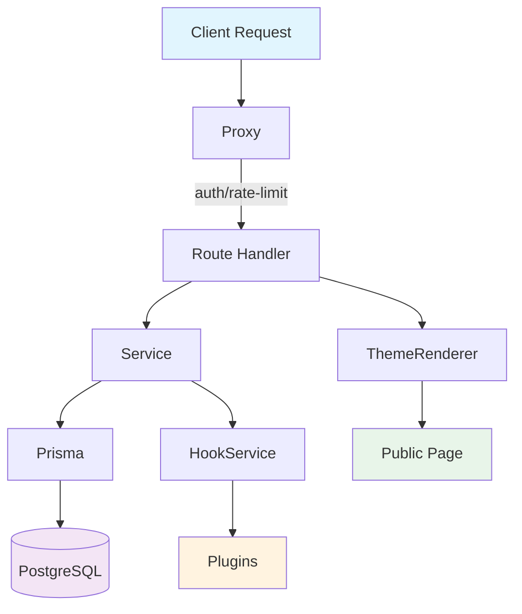
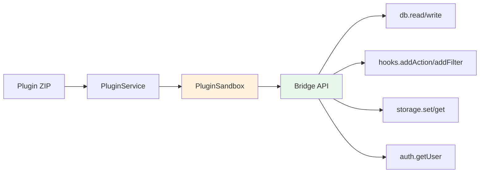
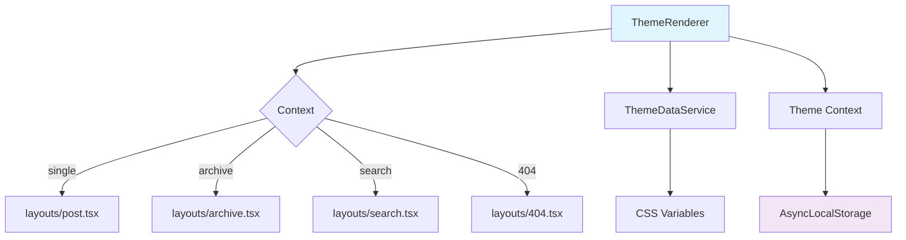

# BlackLotusCMS

[](LICENSE)
[](https://nextjs.org/)
[](https://www.typescriptlang.org/)

BlackLotusCMS is a modern, high-performance, and extensible Content Management System built with **Next.js 16**, **Prisma**, and **Pothos GraphQL**.

## Features

- **Next.js 16 (App Router):** React Server Components for zero-bloat frontend.
- **Zero .env Architecture:** Configuration via `.secrets.json`, no environment variables.
- **Custom Post Types:** Flexible content modeling with taxonomies and custom fields.
- **Type-Safe GraphQL:** Pothos + Prisma for end-to-end type safety.
- **Plugin System:** Secure execution via isolated-vm sandbox.
- **RBAC Security:** Role-based access control with capability-based permissions.
- **Multi-Storage:** Local, S3, and R2 storage drivers.

---

## Requirements

| Requirement | Version |
|-------------|---------|
| Node.js | >= 20 |
| pnpm | >= 8 |
| PostgreSQL | >= 15 |

---

## Installation

### 1. Clone and install
```bash
git clone https://github.com/your-org/blacklotuscms.git
cd blacklotuscms
pnpm install
```

### 2. Start PostgreSQL
```bash
# Using Docker (optional)
docker run -d --name postgres -e POSTGRES_DB=blacklotuscms -e POSTGRES_PASSWORD=password -p 5432:5432 postgres:15-alpine

# Or use your existing PostgreSQL instance
```

### 3. Initialize configuration
```bash
touch .secrets.json .installed
```

### 4. Generate Prisma client
```bash
pnpm prisma generate
```

### 5. Start development server
```bash
pnpm dev
```

### 6. Complete installation
Open `http://localhost:3000/install` and follow the setup wizard.

---

## Available Scripts

| Command | Description |
|---------|-------------|
| `pnpm dev` | Start development server |
| `pnpm build` | Build for production |
| `pnpm start` | Start production server |
| `pnpm lint` | Run ESLint |
| `pnpm test` | Run unit tests (Vitest) |
| `pnpm prisma generate` | Generate Prisma client |
| `pnpm prisma db push` | Push schema to database |
| `pnpm prisma studio` | Open Prisma Studio |

---

## Project Structure

```
blacklotuscms/
├── src/
│   ├── app/                    # Next.js App Router
│   │   ├── (admin)/           # Admin panel routes
│   │   ├── (public)/          # Public routes
│   │   ├── api/               # API routes (REST + GraphQL)
│   │   └── auth/              # Authentication routes
│   ├── components/            # React components
│   │   └── admin/             # Admin UI components
│   ├── core/
│   │   ├── sandbox/           # Plugin sandbox (isolated-vm)
│   │   └── services/          # Business logic (20+ services)
│   ├── lib/                   # Shared utilities
│   │   ├── auth.ts            # NextAuth configuration
│   │   ├── builder.ts         # Pothos GraphQL builder
│   │   ├── config.ts          # Zod-validated configuration
│   │   ├── errors.ts          # Error handling
│   │   ├── logger.ts          # Structured logging
│   │   ├── prisma.ts          # Prisma client proxy
│   │   ├── secrets.ts         # Zero .env secrets management
│   │   └── storage.ts         # Multi-driver storage
│   ├── schemas/               # Zod validation schemas
│   └── types/                 # TypeScript types and DTOs
├── prisma/
│   └── schema.prisma          # Database schema
├── themes/
│   └── default/               # Default theme
├── specs/                     # SDD documentation
├── docs/                      # Developer documentation
└── tasks/                     # Task management
```

---

## Architecture



### Key Components

| Component | File | Purpose |
|-----------|------|---------|
| Proxy | `src/proxy.ts` | Auth, rate limiting, installation gate |
| Secrets | `src/lib/secrets.ts` | Zero .env configuration |
| Auth | `src/lib/auth.ts` | NextAuth JWT setup |
| GraphQL | `src/lib/builder.ts` | Pothos schema builder |
| Prisma | `src/lib/prisma.ts` | Lazy database client |
| Services | `src/core/services/` | Business logic with RBAC |
| Sandbox | `src/core/sandbox/` | Plugin isolation (isolated-vm) |
| Hooks | `src/core/services/HookService.ts` | Actions + Filters system |
| Theme Renderer | `src/components/ThemeRenderer.tsx` | Dynamic theme loading |

---

## Core Systems

### Plugin System

Plugins execute in an isolated sandbox (`isolated-vm`) with a secure Bridge API:



- **Sandbox:** Memory limit (512MB default), timeout (30s default)
- **Rate Limit:** 50 DB queries/second per plugin
- **Permissions:** Plugins must request access to data/hooks
- **Docs:** [Plugin Development Guide](./docs/PLUGINS.md)

### Hook System (Actions + Filters)

WordPress-style extensibility ported to TypeScript:

```typescript
// Register an action (event handler)
hookService.addAction('post.created', (post) => {
  console.log('New post:', post.title);
});

// Register a filter (data transformation)
hookService.addFilter('post.before_validate', (data) => {
  data.title = data.title.trim();
  return data;
});
```

- **Actions:** Execute code at specific points (post.created, user.updated)
- **Filters:** Transform data in pipeline (content.title, route_access)
- **Audit Log:** All hook calls are logged with source and timestamp

### Theme System

Themes are React Server Components with CSS scoping:



- **Dynamic Import:** Layouts loaded based on route context
- **CSS Scoping:** All styles wrapped in `.blacklotuscms-theme`
- **Permission Gate:** Themes request access to system data
- **SDK:** `getPost()`, `getField()`, `getPostsByType()` helpers
- **Docs:** [Theme Development Guide](./docs/THEMES.md)

### RBAC (Role-Based Access Control)

```typescript
// Capability check
if (!canPerformAction(user, 'post.create')) {
  throw new BlackLotusCMSError('No permission', 403, 'AUTH_FORBIDDEN');
}

// Own resource check
if (!canPerformAction(user, 'post.update', post.authorId)) {
  // User can only edit their own posts
}
```

| Role | Capabilities |
|------|--------------|
| Administrador | Full access (bypass all checks) |
| Editor | CRUD all posts, media, comments |
| Autor | CRUD own posts, upload media |
| Colaborador | Create drafts only |
| Assinante | Read content, edit profile |

---

## Documentation

- **[Onboarding Guide](./docs/onboarding.md)** - Getting started
- **[Coding Standards](./docs/coding-standards.md)** - Code conventions
- **[REST API](./docs/API_REST.md)** - Endpoint reference
- **[GraphQL API](./docs/API_GRAPHQL.md)** - Schema and queries
- **[Theme Development](./docs/THEMES.md)** - Create themes
- **[Plugin Development](./docs/PLUGINS.md)** - Build plugins
- **[Compliance](./docs/COMPLIANCE.md)** - LGPD & GDPR

---

## Testing

```bash
# Unit tests
pnpm test

# E2E tests (requires Playwright)
pnpm exec playwright test
```

---

## Troubleshooting

**Prisma Client not generated**
```bash
pnpm prisma generate
```

**Database connection failed**
Check `.secrets.json` for correct `DATABASE_URL`.

**Port 3000 in use**
```bash
lsof -ti:3000 | xargs kill -9
```

---

## License

MIT License - Copyright (c) 2026 BlackLotusCMS. See [LICENSE](./LICENSE) for details.
