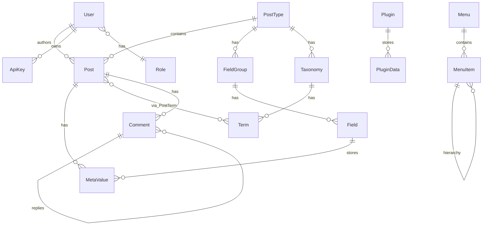

# Database Design - BlackLotusCMS

## Entity Relationship Diagram

## Entidades

### User
- `id`: UUID (PK)
- `email`: String (unique)
- `passwordHash`: String (bcrypt)
- `roleId`: UUID (FK -> Role)
- `image`: String? (avatar URL)
- `createdAt`: DateTime
- `updatedAt`: DateTime

### Role
- `id`: UUID (PK)
- `name`: String (unique) - ex: "Administrador", "Editor", "Autor", "Colaborador", "Assinante"
- `capabilities`: JSON - ex: `{ "post": { "create": true, "read": true } }`

### ApiKey
- `id`: UUID (PK)
- `name`: String - ex: "App Mobile"
- `key`: String (unique) - SHA-256 hash da chave plain text
- `userId`: UUID (FK -> User, onDelete: Cascade)
- `rateLimit`: Int (default: 60 req/min)
- `expiresAt`: DateTime?
- `lastUsedAt`: DateTime?
- `createdAt`: DateTime

### PostType
- `id`: UUID (PK)
- `slug`: String (unique) - ex: "post", "page"
- `label`: String - ex: "Posts", "Pages"
- `hierarchical`: Boolean (default: false)
- `showInRest`: Boolean (default: true)
- `showInGraphql`: Boolean (default: true)
- `supportsTitle`, `supportsEditor`, `supportsPermalink`, `supportsTaxonomies`: Boolean

### Post
- `id`: UUID (PK)
- `postTypeId`: UUID (FK -> PostType)
- `title`: String
- `slug`: String (unique)
- `content`: Text?
- `status`: String (default: "draft") - draft, published, private
- `authorId`: UUID (FK -> User)
- `publishedAt`: DateTime?
- `expiresAt`: DateTime?
- `seoTitle`: String? (max 70)
- `seoDescription`: String? (max 160)
- `ogImage`: String?
- `noIndex`: Boolean (default: false)
- Indexes: [status, publishedAt], [authorId], [postTypeId]

### FieldGroup
- `id`: UUID (PK)
- `postTypeId`: UUID (FK -> PostType)
- `title`: String
- `locationRules`: JSON - regras de exibição

### Field
- `id`: UUID (PK)
- `fieldGroupId`: UUID (FK -> FieldGroup)
- `name`: String - chave interna (ex: "telefone_contato")
- `label`: String - nome exibido
- `type`: String - text, image, repeater, etc.
- `config`: JSON - min/max, required, etc.

### MetaValue
- `id`: UUID (PK)
- `postId`: UUID (FK -> Post)
- `fieldId`: UUID (FK -> Field)
- `value`: JSON - o dado real
- Indexes: [postId], [fieldId]

### Taxonomy
- `id`: UUID (PK)
- `slug`: String (unique)
- `label`: String
- `postTypeId`: UUID (FK -> PostType)

### Term
- `id`: UUID (PK)
- `taxonomyId`: UUID (FK -> Taxonomy)
- `name`: String
- `slug`: String (unique)

### PostTerm
- `postId`: UUID (FK -> Post)
- `termId`: UUID (FK -> Term)
- PK composta: [postId, termId]

### Plugin
- `id`: UUID (PK)
- `name`: String (unique)
- `version`: String
- `isActive`: Boolean (default: false)
- `manifest`: JSON - conteudo do plugin.json
- `authorizedPermissions`: JSON?
- `sandboxId`: String?

### PluginData
- `id`: UUID (PK)
- `pluginId`: UUID (FK -> Plugin, onDelete: Cascade)
- `key`: String
- `value`: JSON
- Unique: [pluginId, key]

### PluginPermission
- `id`: UUID (PK)
- `requesterPlugin`: String
- `providerPlugin`: String
- `capability`: String
- `status`: String (default: "pending") - pending, approved, denied
- Unique: [requesterPlugin, providerPlugin, capability]

### Media
- `id`: UUID (PK)
- `name`: String
- `url`: String
- `thumbnail`: String?
- `mimeType`: String
- `size`: Int
- `metadata`: JSON? - { width, height, format }
- `createdAt`: DateTime

### Setting
- `key`: String (PK)
- `value`: JSON

### ThemeData
- `id`: UUID (PK)
- `themeName`: String
- `key`: String
- `value`: JSON
- `createdAt`, `updatedAt`: DateTime
- Unique: [themeName, key]

### ThemePermission
- `id`: UUID (PK)
- `requesterTheme`: String
- `providerName`: String
- `capability`: String
- `status`: String (default: "pending")
- Unique: [requesterTheme, providerName, capability]

### Menu
- `id`: UUID (PK)
- `name`: String (unique)
- `slug`: String (unique)
- `createdAt`: DateTime

### MenuItem
- `id`: UUID (PK)
- `menuId`: UUID (FK -> Menu, onDelete: Cascade)
- `label`: String
- `url`: String
- `order`: Int (default: 0)
- `parentId`: UUID? (FK -> MenuItem, auto-relacionamento)

### Comment
- `id`: UUID (PK)
- `postId`: UUID (FK -> Post, onDelete: Cascade)
- `author`: String
- `email`: String
- `content`: Text
- `status`: String (default: "pending") - approved, pending, spam
- `ip`: String?
- `parentId`: UUID? (FK -> Comment, auto-relacionamento)
- `createdAt`: DateTime
