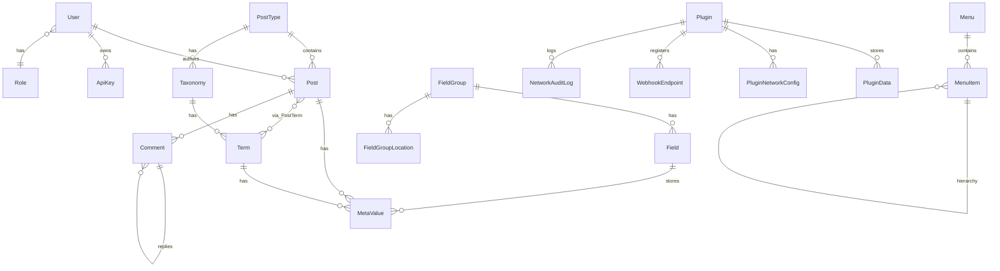

# Database Design - BlackLotusCMS

## Entity Relationship Diagram

```mermaid
erDiagram
    User ||--o{ Post : authors
    User ||--o{ ApiKey : owns
    User }o--|| Role : has
    PostType ||--o{ Post : contains
    PostType ||--o{ Taxonomy : has
    FieldGroup ||--o{ Field : has
    FieldGroup ||--o{ FieldGroupLocation : has
    Post ||--o{ MetaValue : has
    Term ||--o{ MetaValue : has
    Field ||--o{ MetaValue : stores
    Taxonomy ||--o{ Term : has
    Post }o--o{ Term : via_PostTerm
    Post ||--o{ Comment : has
    Comment ||--o{ Comment : replies
    Plugin ||--o{ PluginData : stores
    Plugin ||--o{ PluginNetworkConfig : has
    Plugin ||--o{ WebhookEndpoint : registers
    Plugin ||--o{ NetworkAuditLog : logs
    Menu ||--o{ MenuItem : contains
    MenuItem ||--o{ MenuItem : hierarchy
```

## Entities

### User
- `id`: UUID (PK)
- `email`: String (unique)
- `passwordHash`: String (bcrypt)
- `roleId`: UUID (FK -> Role)
- `image`: String? (avatar URL)
- `createdAt`: DateTime
- `updatedAt`: DateTime

### Role
- `id`: UUID (PK)
- `name`: String (unique) - e.g., "Administrator", "Editor", "Author", "Contributor", "Subscriber"
- `capabilities`: JSON - e.g., `{ "post": { "create": true, "read": true } }`

### ApiKey
- `id`: UUID (PK)
- `name`: String - e.g., "Mobile App"
- `key`: String (unique) - SHA-256 hash of plain text key
- `userId`: UUID (FK -> User, onDelete: Cascade)
- `rateLimit`: Int (default: 60 req/min)
- `expiresAt`: DateTime?
- `lastUsedAt`: DateTime?
- `createdAt`: DateTime

### PostType
- `id`: UUID (PK)
- `slug`: String (unique) - e.g., "post", "page"
- `label`: String - e.g., "Posts", "Pages"
- `hierarchical`: Boolean (default: false)
- `showInRest`: Boolean (default: true)
- `showInGraphql`: Boolean (default: true)
- `supportsTitle`, `supportsEditor`, `supportsPermalink`, `supportsTaxonomies`: Boolean

### Post
- `id`: UUID (PK)
- `postTypeId`: UUID (FK -> PostType)
- `title`: String
- `slug`: String (unique)
- `content`: Text?
- `status`: String (default: "draft") - draft, published, private
- `authorId`: UUID (FK -> User)
- `publishedAt`: DateTime?
- `expiresAt`: DateTime?
- `seoTitle`: String? (max 70)
- `seoDescription`: String? (max 160)
- `ogImage`: String?
- `noIndex`: Boolean (default: false)
- Indexes: [status, publishedAt], [authorId], [postTypeId]

### FieldGroup
- `id`: UUID (PK)
- `title`: String

### FieldGroupLocation
- `id`: UUID (PK)
- `fieldGroupId`: UUID (FK -> FieldGroup, onDelete: Cascade)
- `locationType`: String - "post_type", "taxonomy", "post", "template", "post_status"
- `locationValue`: String - e.g., "post", "page", "category", "my-specific-post"
- `locationParam`: String? - e.g., "technology" (for specific taxonomy term)
- Unique: [fieldGroupId, locationType, locationValue, locationParam]

### Field
- `id`: UUID (PK)
- `fieldGroupId`: UUID (FK -> FieldGroup)
- `name`: String - internal key (e.g., "phone_contact")
- `label`: String - display name
- `type`: String - text, image, repeater, tab, section, etc. (tab/section are visual organizers, no MetaValue)
- `config`: JSON - field configuration:
  - For simple fields: `{ width, required, validation: { min, max }, conditionalLogic: { status, rules }, instructions }`
  - For Repeater: `{ repeater: { fields: [...], layout: 'block'|'table'|'row', minItems, maxItems } }`
  - For Flexible Content: `{ flexibleContent: { layouts: [{ name, label, fields: [...], layout }], minItems, maxItems } }`
  - For Select: `{ options: [{ label, value }] }`
  - For Icon: `{ iconSource: 'lucide'|'custom', iconName: string, iconSvg: string, iconColor: string, iconSize: number }`
  - Sub-fields are stored in config as array of objects with same Field structure

### MetaValue
- `id`: UUID (PK)
- `postId`: UUID? (FK -> Post, onDelete: Cascade) - nullable for taxonomies
- `termId`: UUID? (FK -> Term, onDelete: Cascade) - nullable for posts
- `fieldId`: UUID (FK -> Field)
- `value`: JSON - the actual data
- Indexes: [postId], [fieldId], [termId]

### Taxonomy
- `id`: UUID (PK)
- `slug`: String (unique)
- `label`: String
- `postTypeId`: UUID (FK -> PostType)

### Term
- `id`: UUID (PK)
- `taxonomyId`: UUID (FK -> Taxonomy)
- `name`: String
- `slug`: String (unique)

### PostTerm
- `postId`: UUID (FK -> Post)
- `termId`: UUID (FK -> Term)
- PK composite: [postId, termId]

### Plugin
- `id`: UUID (PK)
- `name`: String (unique)
- `version`: String
- `isActive`: Boolean (default: false)
- `manifest`: JSON - plugin.json content
- `authorizedPermissions`: JSON?
- `sandboxId`: String?

### PluginData
- `id`: UUID (PK)
- `pluginId`: UUID (FK -> Plugin, onDelete: Cascade)
- `key`: String
- `value`: JSON
- Unique: [pluginId, key]

### PluginPermission
- `id`: UUID (PK)
- `requesterPlugin`: String
- `providerPlugin`: String
- `capability`: String
- `status`: String (default: "pending") - pending, approved, denied
- Unique: [requesterPlugin, providerPlugin, capability]

### Media
- `id`: UUID (PK)
- `name`: String
- `url`: String
- `thumbnail`: String?
- `mimeType`: String
- `size`: Int
- `metadata`: JSON? - { width, height, format }
- `createdAt`: DateTime

### Setting
- `key`: String (PK)
- `value`: JSON

### ThemeData
- `id`: UUID (PK)
- `themeName`: String
- `key`: String
- `value`: JSON
- `createdAt`, `updatedAt`: DateTime
- Unique: [themeName, key]

### ThemePermission
- `id`: UUID (PK)
- `requesterTheme`: String
- `providerName`: String
- `capability`: String
- `status`: String (default: "pending")
- Unique: [requesterTheme, providerName, capability]

### Menu
- `id`: UUID (PK)
- `name`: String (unique)
- `slug`: String (unique)
- `createdAt`: DateTime

### MenuItem
- `id`: UUID (PK)
- `menuId`: UUID (FK -> Menu, onDelete: Cascade)
- `label`: String
- `url`: String
- `order`: Int (default: 0)
- `parentId`: UUID? (FK -> MenuItem, self-referencing)

### Comment
- `id`: UUID (PK)
- `postId`: UUID (FK -> Post, onDelete: Cascade)
- `author`: String
- `email`: String
- `content`: Text
- `status`: String (default: "pending") - approved, pending, spam
- `ip`: String?
- `parentId`: UUID? (FK -> Comment, self-referencing)
- `createdBy`: String?
- `createdAt`: DateTime

### PluginNetworkConfig
- `id`: UUID (PK)
- `pluginId`: UUID (FK -> Plugin, unique, onDelete: Cascade)
- `allowedDomains`: String[] — whitelist of domains for HTTP outbound
- `httpRateLimit`: Int (default: 20) — req/s for external HTTP
- `webhookSecret`: String? — HMAC-SHA256 secret for webhooks
- `isActive`: Boolean (default: true)
- `createdAt`, `updatedAt`: DateTime

### WebhookEndpoint
- `id`: UUID (PK)
- `pluginId`: UUID (FK -> Plugin, onDelete: Cascade)
- `eventId`: String — e.g., "payment.completed"
- `url`: String — generated: `/api/v1/webhooks/:pluginName/:eventId`
- `isActive`: Boolean (default: true)
- `createdAt`: DateTime
- Unique: [pluginId, eventId]

### NetworkAuditLog
- `id`: UUID (PK)
- `pluginId`: UUID (FK -> Plugin, onDelete: Cascade)
- `pluginName`: String
- `type`: String — "http.outbound" | "webhook.inbound"
- `url`: String?
- `method`: String?
- `status`: Int?
- `error`: String?
- `timestamp`: DateTime (default: now())
